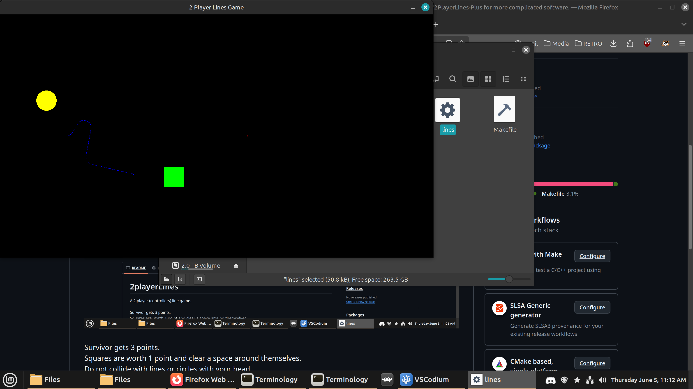

<!--- This files is to be viewed at https://github.com/ZacGeurts/2PlayerLines --->
# 2playerLines
A 2 player (controllers) line game. 
 
The file is small enough that it should output working code as a test for AI.
 

The Logic is that it checks in front of the player for a dot of color. Black is safe. 
Adding a background probably will not play nice with collision depending on collision check order.
 
MIT license means do whatever with it. 
Get rich. whatever. 
 
The unaltered main.cpp version will be hosted here. 
Please, do not redistribute main.cpp for profit, unaltered. 
Have AI change main.cpp and put your name on it. 
main.cpp is intended to run at some point on a rediculous number of systems that have some access to OpenGL and SDL. 
I have a sideproject that is creating toolchains for the platforms. 
 
What does any of this mean?: 
There is one small main.cpp that AI can read in entirety and write include files or other programs from that run on various platforms. 
 
If you have a tiny main.cpp that plays 2PlayerLines on your Dreamcast, you can do anything with main.cpp that uses sdl and opengl, like a platformer. 
Even a new 4 player game if you have the controllers and friends. 
main.cpp is your foot in the door. 
 
Planned platforms:
aarch64 
armv6 
armv7 
armv8 
dreamcast 
nintendo_3ds 
nintendo_switch 
nintendo_wii 
nintendo_wii_u 
ouya 
ps3 
ps4 
psp 
ps_vita 
steam_deck 
steam_link 
x86 
x86_64 
 
Controls and about main.cpp
Survivor gets 3 points. 
Squares are worth 1 point and clear a space around themselves. 
Do not collide with lines or circles with your head. 
Bouncing circles erase lines and another appears every 5 seconds. 
You are invincible until first move unless you hit the wall. 
X or A pauses. 
Steer with controller triggers. 
 
To download source, hit the green code button up top if you don't use git. 
 
`git clone https://github.com/ZacGeurts/2playerLines` 
`cd 2playerLines`
Type `make` to build. Needs OpenGL (Mesa) and SDL2. 
`./lines` to run 
Save a backup of your working builds if you cannot afford to lose them. 
`make clean` before you run make again to clear out the previous build. 
If you destroy your main.cpp, you can come download this one again. 
Modifiing files other than main.cpp is not a beginner project.
